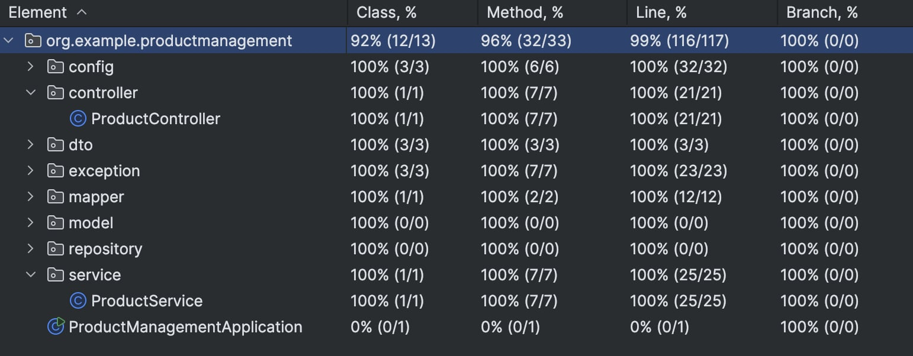

# Product Management Application

## Overview

This is a backend application built with Spring Boot that provides a REST API for managing products. It supports basic CRUD operations such as creating, updating, and deleting products.

The application is secured using Spring Security with role-based access control and is fully dockerized for easy setup.

---

## Features

- CRUD operations for products
- REST API
- Role-based security (USER, ADMIN)
- HTTP Basic Authentication
- Integration tests with real database
- Dockerized environment

---

## Security

The application uses Spring Security with two roles:

- USER – can access read-only endpoints
- ADMIN – can perform all operations (create, update, delete)

Authentication is handled using HTTP Basic Authentication.

Security rules are covered by dedicated tests to ensure correct access control.

---

## Testing

The project includes several types of tests:

- **Unit tests** – for validating business logic
- **Controller tests** – for testing REST API endpoints and request validation
- **Security tests** – verifying authorization and role-based access
- **Integration tests** – using a real PostgreSQL database via Testcontainers

Integration tests run against a real database container instead of an in-memory database, providing more realistic test coverage.


---

## Technologies

- Java
- Spring Boot
- Spring Security
- PostgreSQL
- Docker
- Testcontainers
- Maven

---

## Running the Application

### Prerequisites

- Docker installed

---

### Build and Run

To build and start the application, run:

```bash
docker compose up --build
